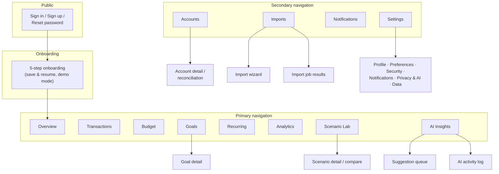

# FinPilot — UX Architecture (Phase 0)

Covers the sitemap, route map, full screen inventory (purpose, primary actions, states), and written
wireframes for the seven key screens. Visual language and tokens live in
[03-design-system.md](03-design-system.md).

Navigation model: **desktop left sidebar** + **compact mobile bottom navigation** (5 slots: Overview,
Transactions, Budget, ⌘ command button, More). A global **command/search action** (⌘K / Ctrl-K and a
persistent button) exposes "Add transaction," "Import statement," "Ask AI," and global search — these
do not occupy navigation slots. Not every destination lives in main navigation.

---

## 1. Sitemap



## 2. Route map

App routes are behind the authenticated layout group; public routes are minimal. Next.js App Router
route groups shown as `(group)`.

| Route | Screen | Notes |
|---|---|---|
| `/` | Redirect → `/overview` (authed) or `/sign-in` | |
| `/(auth)/sign-in` | Sign in | Rate-limited; generic error copy |
| `/(auth)/sign-up` | Sign up | |
| `/(auth)/reset-password` | Request reset | |
| `/(auth)/reset-password/[token]` | Set new password | Single-use, expiring token |
| `/onboarding` | 5-step wizard | Save-and-resume via `onboarding_state` in preferences; step in query `?step=3` |
| `/overview` | Overview dashboard | Default landing |
| `/transactions` | Transactions workspace | Filters/saved view in URL query for shareable state |
| `/budget` | Budget (current period) | `?period=2026-08` for history |
| `/goals` | Goals list | |
| `/goals/[goalId]` | Goal detail | History, what-if, milestones |
| `/recurring` | Recurring & subscriptions | List + calendar toggle `?view=calendar` |
| `/analytics` | Analytics workspace | Analysis config in query params |
| `/scenarios` | Scenario Lab home (list + new) | |
| `/scenarios/[scenarioId]` | Scenario editor | Unsaved-changes guard |
| `/scenarios/compare?a=…&b=…` | Side-by-side comparison | |
| `/insights` | AI Insights hub (tabs: Insights · Assistant · Queue) | `?tab=queue` |
| `/insights/activity` | AI activity log | What was generated, data used, approval state |
| `/accounts` | Accounts list + net position | |
| `/accounts/[accountId]` | Account detail + reconciliation | |
| `/imports` | Import history + profiles | |
| `/imports/new` | Import wizard | Steps: upload → map → review → resolve → confirm → results |
| `/imports/[jobId]` | Import job results | Also wizard resume point |
| `/notifications` | Notification centre | |
| `/settings` | Redirect → `/settings/profile` | |
| `/settings/profile` | Name, email, password change | |
| `/settings/preferences` | Locale, currency, timezone, theme, start screen | |
| `/settings/security` | Sessions list/revoke, passkey placeholder | |
| `/settings/notifications` | Alert thresholds, digest cadence, quiet hours | |
| `/settings/privacy` | Privacy Mode, AI consent, per-feature AI data disclosure | |
| `/settings/categories` | Category groups, categories, tags, merchants | *(Added in Phase 2 — classification management needed a home; settings keeps main nav uncluttered)* |
| `/settings/data` | Export, retention, staged account deletion | |
| `/journal` | Money Decision Journal | Reached from More/command menu, insight cards, and transaction drawer — not primary nav |

Route handler (non-page) surfaces: `/api/imports/*` (upload, commit), `/api/export/*`,
`/api/assistant/stream`, `/api/attachments/[id]` (signed access), `/api/health`.

## 3. Screen inventory

States legend — every screen must implement: **L** loading (skeleton), **E** empty (helpful,
action-oriented), **Err** error (retry, no raw provider/db messages), **P** partial data
(e.g. pending transactions excluded note). Screens with lists add pagination; screens with charts
add table alternative + tooltip + legend.

| Screen | Purpose (user question it answers) | Primary actions | Notable states & edge cases |
|---|---|---|---|
| Sign in / up / reset | "Get me in securely." | Authenticate; reset | Rate-limit lockout copy; enumeration-safe messages |
| Onboarding (5 steps) | "Set me up correctly with minimum effort." | Continue; skip import; enter demo mode | Save-and-resume; per-step "why we ask"; final personalized summary |
| Overview | "How am I doing right now? Anything wrong?" | Expand safe-to-spend; open top insight; quick add (⌘K) | P: pending excluded note; E: pre-import state points to import/demo; balance-hidden (privacy toggle) |
| Transactions | "What happened, and is it recorded correctly?" | Add/edit in drawer; bulk edit; filter; saved views (All, Needs Review, Subscriptions, Possible Duplicates, Cash, Excluded) | Dense table ≥1024px, grouped cards <768px; drawer preserves filters; undo for destructive ops; change history per row |
| Budget | "Am I on pace this cycle?" | Edit allocation (drawer); copy last cycle; adjust mid-cycle; review suggestion queue | Payday vs calendar cycles; warning colors only when intervention is useful; zero-based unallocated banner |
| Goals | "Will I hit my targets?" | Add goal; contribute (record allocation vs link real transfer); adjust | "Allocation ≠ money moved" labeling; behind/on-track/ahead |
| Goal detail | "What will fix this goal?" | What-if sliders (contribution, date); link scenario; milestones | Forecast band; contribution history |
| Recurring | "What's coming, and what changed?" | Confirm/pause/end pattern; usage confirm; cancellation checklist + savings simulation | Confirmed vs inferred clearly split; price-change evidence, non-alarmist; BNPL estimates labeled |
| Analytics | "Answer my specific money question." | Change dimensions/period/compare; export CSV; save analysis | Summary sentence + one-question chart + underlying table; custom periods; account/category/tag filters |
| Scenario Lab | "What happens if…?" | Add/edit scenario events; save (explicit); compare | Simulation never touches real records; unsaved-changes guard; uncertainty band |
| AI Insights | "What should I know / ask / approve?" | Read insight evidence; ask assistant; approve/edit/dismiss/snooze suggestions | Three separated tabs; structured answer cards; Privacy-Mode variant hides assistant, keeps deterministic insights |
| AI activity | "What did AI generate from my data?" | Filter by feature; view approval status | Consent-state annotations |
| Accounts | "What do I have and owe?" | Add/archive account; transfer between accounts | Net worth = assets − liabilities; non-MYR accounts sectioned separately |
| Account detail | "Does this account reconcile?" | Reconcile against statement balance; adjust | Discrepancy resolution flow; snapshot history |
| Imports | "Get statements in cleanly." | New import; manage profiles; open past jobs | Wizard never commits before confirmation; resumable jobs |
| Import wizard | "Map once, trust forever." | Upload; map; resolve; confirm | Encoding/delimiter detection; per-row errors; duplicate flags; profile save |
| Import results | "What exactly happened?" | Open needs-review set; undo window | Added / skipped / duplicates / failed / needs-review counts |
| Notifications | "What needs my attention?" | Read; dismiss; tune thresholds inline | Deduplicated; quiet hours; anxiety-aware defaults |
| Journal | "What was going on when I spent this?" | Annotate period/transaction; review outcomes | Outcome review prompts ("did the saving happen?") |
| Settings (6 pages) | "Control my account, data, and AI." | Save preferences; export; delete account; Privacy Mode | Deletion is staged with recovery window; AI disclosure per feature |

## 4. Written wireframes

Conventions: `[...]` button/control, `▸` expandable, `⟨chart⟩` visualization with table alternative.
Desktop-first sketches; mobile collapses columns top-to-bottom with the same priority order.

### 4.1 Overview dashboard

One primary status panel, a secondary insight column, lower-detail sections below. Not a grid of
equal-weight cards.

```text
┌ Sidebar ┐ ┌──────────────────────────────────────────────┬───────────────────────┐
│ Overview│ │ Good evening, Aisyah · August cycle (26 Jul–25 Aug)   [👁 hide] [⌘K] │
│ Trans.  │ ├──────────────────────────────────────────────┬───────────────────────┤
│ Budget  │ │ PRIMARY STATUS PANEL                         │ TOP INSIGHT           │
│ Goals   │ │ Liquid balance      RM 8,520   ▲ RM 340 vs   │ Food spending up 23%  │
│ Recur.  │ │                                 last cycle   │ vs July. Delivery is  │
│ Analyt. │ │ Safe to spend  TODAY RM 96 · UNTIL PAYDAY    │ RM 320 of the RM 410  │
│ Scen.   │ │ RM 1,180  (range RM 980–1,310)               │ increase. Excludes 2  │
│ AI      │ │ ▸ Why: RM 420 bills · RM 200 goal · RM 150   │ pending transactions. │
│ ─────   │ │   buffer · income confidence: high           │ Confidence: High ·    │
│ Accounts│ │ ⟨cash-flow forecast, 30d, 3 bands⟩           │ 18 posted txns        │
│ Imports │ │                                              │ ▸ How calculated      │
│ Notifs  │ ├──────────────┬───────────────┬───────────────┤ [Set delivery budget] │
│ Settings│ │ Income       │ Expenses      │ Savings (rate)│ [See transactions]    │
│         │ │ RM 5,200     │ RM 3,150      │ RM 2,050 (39%)│───────────────────────│
│         │ ├──────────────┴───────────────┴───────────────┤ UPCOMING BILLS        │
│         │ │ BUDGET STATUS (compact)      GOALS (compact) │ 28 Aug Unifi  RM 129  │
│         │ │ On pace 6 · Watch 2 · Over 1 │ Emergency 62% │ 1 Sep  Rent RM 1,600  │
│         │ │ [Open budget]                │ [Open goals]  │ 1 Sep  ⚠ bill cluster │
└─────────┘ └──────────────────────────────┴───────────────┴───────────────────────┘
```

- Balance-hidden mode masks all amounts (`RM •••••`) but keeps statuses and shapes.
- Empty state (no data): the primary panel becomes a two-action card — [Import a statement] [Try demo
  mode] — with a short explanation of what the dashboard will show.

### 4.2 Transactions

```text
┌ Toolbar: [＋ Add] [Import] | Saved views: All · Needs Review (12) · Subscriptions ·      ┐
│ Possible Duplicates · Cash · Excluded | Filters: [Account ▾][Category ▾][Date ▾][Tag ▾] │
│ [Search………………………]  Sort: Date ▾            Bulk: ☐ select → [Categorize][Tag][Exclude] │
├──────────────────────────────────────────────────────────────────────────────────────────┤
│ ☐  Date    Merchant (original ▸)   Account   Category [conf]  Tags     Amount    Status  │
│ ☐  15 Aug  GrabFood ▸ "GRABFOOD*KL" Maybank   Food delivery ●98%  —    −RM 32.50  Posted │
│ ☐  15 Aug  Shopee ▸                 CC        Needs review ⚑      —    −RM 129.00 Review │
│ ☐  14 Aug  Transfer → TnG eWallet   Maybank   Transfer (excluded from spend)  −RM 100.00 │
│ …                                                              [cursor pagination ↓]     │
├────────────── Side drawer (opens on row; list & filters stay put) ──────────────────────┤
│ Edit: date · merchant (normalized + original preserved) · account · category · tags ·    │
│ status (pending/posted) · exclude toggle · notes · receipt attach · split editor         │
│ (rows must sum to parent; part reimbursable) · refund link · journal annotation ·        │
│ change history ▸ · [Soft delete] (undo toast)                                            │
└──────────────────────────────────────────────────────────────────────────────────────────┘
```

Mobile: grouped-by-day cards (merchant, category chip, amount, status dot); tap opens the same
drawer full-screen; filters collapse into a filter sheet.

### 4.3 Budget

```text
┌ Cycle: 26 Jul – 25 Aug (payday cycle) [◀][▶]   Mode: Flexible ▾   [Copy last cycle]      ┐
│ Planned RM 3,600 · Spent RM 2,410 · Remaining RM 1,190 · Pace: on track (67% at day 21) │
│ ⟨planned vs actual trend, this cycle vs last⟩                                            │
├──────────────────────────────────────────────────────────────────────────────────────────┤
│ SUGGESTIONS (2) ▸  "Raise Groceries to RM 620 — 3-cycle median RM 605, excludes Dec      │
│ travel (journal), trade-off: −RM 20/cycle to Emergency fund"  [Approve][Edit][Dismiss ▾] │
├──────────────────────────────────────────────────────────────────────────────────────────┤
│ Category          Planned   Spent    Remaining  Pace                                     │
│ Groceries         RM 600    RM 402   RM 198     ▓▓▓▓▓▓▓░░░ on pace                       │
│ Food delivery     RM 250    RM 238   RM  12     ▓▓▓▓▓▓▓▓▓░ ⚠ ahead of pace (day 21/31)   │
│ Transport         RM 300    RM 176   RM 124     ▓▓▓▓▓░░░░░ on pace                       │
│ …                                    [row click → details drawer: edit planned, rollover │
│                                       setting, notes, mid-cycle adjustment with reason]  │
└──────────────────────────────────────────────────────────────────────────────────────────┘
```

Warning color only where intervention helps (pace-based), never for merely spending. Zero-based mode
adds an "Unallocated: RM x" banner that must reach zero.

### 4.4 Goals

```text
┌ [＋ New goal]                                                                            ┐
│ ┌ Emergency fund ────────────┐ ┌ Japan trip ────────────────┐ ┌ Laptop ───────────────┐ │
│ │ RM 9,300 / RM 15,000 (62%) │ │ RM 2,100 / RM 6,000 (35%)  │ │ RM 800 / RM 2,800     │ │
│ │ ▓▓▓▓▓▓░░░░  On track       │ │ ▓▓▓░░░░░░░  Behind ⚠       │ │ ▓▓▓░░░░░░  Ahead      │ │
│ │ Needs RM 480/cycle         │ │ Needs RM 650/cycle (+150)  │ │ Needs RM 250/cycle    │ │
│ │ Est. done Mar 2027         │ │ Target Jun 2027 at risk    │ │ Est. done Dec 2026    │ │
│ └────────────────────────────┘ └────────────────────────────┘ └───────────────────────┘ │
├── Goal detail ──────────────────────────────────────────────────────────────────────────┤
│ ⟨projection band to target date⟩ · Milestones · Contribution history (allocation vs      │
│ linked real transfer — labeled differently) · What-if: [contribution RM ▁▁] [date ▁▁]    │
│ → recomputed completion + trade-off sentence · [Open in Scenario Lab]                    │
└──────────────────────────────────────────────────────────────────────────────────────────┘
```

Motivational, not childish: progress + honest forecast, no confetti-by-default (respect reduced
motion; a single subtle milestone acknowledgment is fine).

### 4.5 Recurring & subscriptions

```text
┌ View: [List | Calendar]   Filter: All · Confirmed · Inferred · Subscriptions · BNPL      ┐
├──────────────────────────────────────────────────────────────────────────────────────────┤
│ NEXT 14 DAYS ⚠ 3 bills cluster around 1 Sep (RM 1,789 total)                             │
│ Merchant     Type          Amount     Next due   Annual cost  Confidence  Status         │
│ Rent         Confirmed exp RM 1,600   1 Sep      RM 19,200    —           Active         │
│ Spotify      Subscription  RM 23.90   3 Sep      RM 286.80    High        ⚠ Price +RM 7  │
│   ▸ evidence: RM 16.90 ×5 (Mar–Jul) → RM 23.90 ×2 (Jul–Aug)  [Acknowledge][Not a sub]    │
│ iCloud+GDrive Duplicate?   —          —          RM 274.80    Medium      ▸ evidence     │
│ SPayLater    BNPL estimate RM 291.58  5 Sep      2 payments left (estimate — confirm?)   │
│ Massage sub  Inferred      RM 89      ~12 Sep    RM 1,068     Low         [Confirm][Not] │
├──────────────────────────────────────────────────────────────────────────────────────────┤
│ Row actions: confirm · pause · end · edit tolerance · usage check-in ·                   │
│ [Cancellation checklist + savings simulation]  (we never claim to cancel for you)        │
└──────────────────────────────────────────────────────────────────────────────────────────┘
```

Calendar view: month grid with bill markers sized by amount, cluster warnings, payday marker.

### 4.6 Scenario Lab

```text
┌ Scenarios: [＋ New]  Saved: "Laptop — Sept" · "Laptop — Nov" · [Compare A vs B]          ┐
├───────────────┬──────────────────────────────────────────────┬───────────────────────────┤
│ INPUTS (left) │ PROJECTION (centre)                          │ IMPACT (right)            │
│ Base: today's │ ⟨90-day projected balance; solid = expected, │ Lowest expected balance   │
│ real data     │ band = optimistic/conservative; dashed =     │ RM 412 on 3 Oct ⚠         │
│ (read-only)   │ baseline without scenario⟩                   │ vs RM 3,212 baseline      │
│ Events:       │                                              │ Goals: Emergency fund     │
│ • One-time    │ Deterministic simulation, recomputes on      │  milestone +3 weeks       │
│   RM 2,800    │ change; NO real records are modified.        │ Budget risk: Electronics  │
│   on 15 Sep   │                                              │ Safer purchase date:      │
│ [＋ add event]│                                              │  after 25 Oct payday      │
│ (income Δ,    │                                              │ Next actions:             │
│ rent Δ, cancel│                                              │ [Save scenario]           │
│ sub, BNPL,    │                                              │ [Create goal instead]     │
│ savings Δ,    │                                              │ [Ask AI about this]       │
│ emergency)    │                                              │ (unsaved-changes guard)   │
└───────────────┴──────────────────────────────────────────────┴───────────────────────────┘
```

Saving is an explicit action. Compare view renders two impact columns over one shared chart.

### 4.7 AI Insights

```text
┌ Tabs: [Insights] [Assistant] [Suggestion queue (4)]        [AI activity ▸] [Privacy ▸]  ┐
├──────────────────────────────────────────────────────────────────────────────────────────┤
│ INSIGHTS: cards, newest first, filterable by type/severity                               │
│ ┌ Insight card ──────────────────────────────────────────────┐                           │
│ │ Conclusion · period compared · contributors (categories/    │                           │
│ │ merchants) · absolute + % change · confidence · data-quality│                           │
│ │ warnings · ▸ How this was calculated · [action] [dismiss]   │                           │
│ └─────────────────────────────────────────────────────────────┘                           │
│ ASSISTANT: input + suggested questions ("Why did I spend more this month?" …)            │
│ Answers are structured cards: conclusion · evidence table/chart · filters & period used  │
│ · assumptions & uncertainty · non-advisory notice · optional actions. Never chat-only:   │
│ every card links to the underlying screen.                                               │
│ QUEUE: one suggestion per row — proposed change, rationale, confidence, evidence         │
│ [Approve] [Edit] [Dismiss — why? ▾] [Snooze ▾]   (feedback recorded for learning)        │
│ Privacy Mode: Assistant tab replaced by explainer; Insights render deterministic         │
│ template phrasing; Queue keeps rule/duplicate/refund suggestions (deterministic).        │
└──────────────────────────────────────────────────────────────────────────────────────────┘
```

### 4.8 Supporting screens (summary wireframes)

- **Onboarding:** progress dots (1 Locale & currency → 2 Income pattern → 3 Accounts & balances →
  4 Priorities, budget style & buffer → 5 Import or demo). Each step: single question block, "why we
  ask" microcopy, [Back][Continue], [Skip for now] where safe. Ends with a personalized summary
  ("Payday 25th · buffer RM 300 · 3 accounts · Emergency fund first").
- **Import wizard:** stepper (Upload → Map fields → Review data → Resolve issues → Confirm →
  Results). Mapping shows live preview of parsed date/amount per column choice; issues screen lists
  per-row problems with inline fixes; confirm screen shows exact counts before any commit; results
  screen links to Needs Review. Profile save prompt on completion.
- **Analytics:** left rail of saved analyses; top bar with dimension/period/compare controls; body =
  one summary sentence + one chart + the underlying data table; [Export CSV].

## 5. Cross-cutting UX rules

1. **Progressive disclosure everywhere:** headline number → expandable "why" → full calculation
   drawer. Never force the detail view.
2. **Confidence and provenance are visible** on every AI-touched element (confidence chip + source:
   rule / model / AI / user).
3. **Nothing fake:** demo data is banner-labeled; unavailable integrations say so; simulated values
   are visually distinct (dashed/onion-skin styling in charts).
4. **Undo over confirm** for reversible actions (soft delete, exclude, categorize); explicit confirm
   only for destructive/irreversible ones (import commit, account deletion, purge).
5. **Drawers preserve context:** editing never navigates away from filtered lists.
6. **Every chart** ships with table alternative, tooltips, legend, and L/E/Err states.
7. **Keyboard:** ⌘K command palette; full tab order; focus visible; table row actions reachable
   without pointer.
8. **Anxiety-aware notifications:** deduplicated, threshold-tunable, quiet hours, calm copy. Red is
   reserved for genuine risk.
9. **Privacy toggle** masks balances globally and persists per device.
10. **URLs hold state** (filters, periods, tabs) so views are bookmarkable and the back button works.
