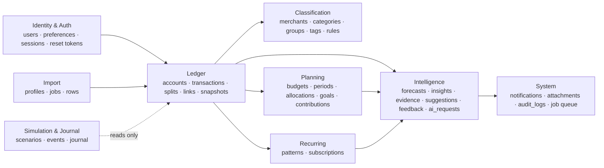

# FinPilot — Domain Model & ERD (Phase 0)

PostgreSQL 16+ is the single source of truth. This document defines the **complete target domain
model**. *(Amended at Phase 0 review:)* tables are migrated **incrementally** — each phase migrates
only the tables its domain requires (schedule in §5.1), and the ERD is the reviewed target those
increments converge to. Phase 1 migrates only the identity/security foundation: `users`,
`user_preferences`, `sessions`, `password_reset_tokens`, `audit_logs`. All migrations are
forward-only and version-controlled; shipped migrations are never edited.

---

## 1. Schema-wide conventions

| Concern | Convention |
|---|---|
| Identifiers | **UUIDv7** (time-ordered) in `uuid` columns, generated in the application layer. Every table's PK is `id uuid`. |
| Money | `bigint` **minor units** (sen). Column names end `_minor`. Every monetary column sits beside a `currency char(3)` (ISO 4217) on the same row or an unambiguous parent. **No floats anywhere near money**; a lint rule and code review gate enforce this. |
| Amount sign | Signed amounts: negative = outflow, positive = inflow. `type` adds semantics (a `refund` is a positive amount in an expense category). `CHECK` constraints pin the sign where the type implies it. |
| Cross-currency safety | Aggregation queries always group by or filter on `currency`; the repository layer refuses mixed-currency sums (raises, never silently adds). |
| Time | `timestamptz` in UTC for instants; separate `date` columns (e.g. `txn_date`) for statement-local calendar dates. Rendering converts to the user's timezone. |
| Timestamps | Every table: `created_at timestamptz not null default now()`, `updated_at timestamptz not null` (app-maintained). |
| Soft delete | `deleted_at timestamptz` on user-recoverable entities (`transactions`, `accounts`, `categories`, `tags`, `savings_goals`, `scenarios`, `attachments`, `journal_entries`). Unique indexes are partial (`where deleted_at is null`). Hard delete happens only via account purge. |
| Ownership | Every user-owned table carries `user_id` **directly** (including child tables like `transaction_splits` via their parent's `user_id` column being denormalized where join-free authorization checks matter: splits, links, allocations carry `user_id` too). Every repository method takes the authenticated `user_id` and filters on it — never client-supplied. |
| Enums | PostgreSQL enum types for closed sets (`account_type`, `txn_type`, `txn_status`, `budget_mode`, `goal_type`, `import_status`, `suggestion_status`, …); Zod mirrors each. |
| Optimistic concurrency | `version int not null default 1` on high-risk editable rows (`transactions`, `budget_allocations`, `accounts`); writes assert the expected version. |
| Audit | Append-only `audit_logs`; important-field change history for transactions is stored there (`entity_type = 'transaction'`) with redacted before/after diffs. |
| Naming | `snake_case`, plural table names, `*_id` FKs, `*_at` instants, `*_minor` money. |

## 2. Domain map (bounded contexts)



Simulation reads real data but **never writes to the ledger** — scenario output lives entirely in
`scenarios`/`scenario_events` and computed projections.

## 3. ERD

```mermaid
erDiagram
    users ||--|| user_preferences : has
    users ||--o{ sessions : has
    users ||--o{ password_reset_tokens : has
    users ||--o{ accounts : owns
    accounts ||--o{ account_balance_snapshots : records
    users ||--o{ merchants : normalizes
    users ||--o{ category_groups : owns
    category_groups ||--o{ categories : contains
    users ||--o{ tags : owns
    transactions ||--o{ transaction_tags : tagged
    tags ||--o{ transaction_tags : applies
    users ||--o{ transactions : owns
    accounts ||--o{ transactions : holds
    merchants |o--o{ transactions : "normalized as"
    categories |o--o{ transactions : classifies
    transactions ||--o{ transaction_splits : "splits into"
    categories |o--o{ transaction_splits : classifies
    transactions ||--o{ transaction_links : "from side"
    transactions ||--o{ transaction_links : "to side"
    users ||--o{ categorization_rules : defines
    users ||--o{ budgets : owns
    budgets ||--o{ budget_periods : cycles
    budget_periods ||--o{ budget_allocations : allocates
    categories ||--o{ budget_allocations : budgeted
    users ||--o{ savings_goals : pursues
    accounts |o--o{ savings_goals : "linked to"
    savings_goals ||--o{ goal_contributions : receives
    transactions |o--o{ goal_contributions : "backed by"
    users ||--o{ recurring_patterns : has
    merchants |o--o{ recurring_patterns : "billed by"
    recurring_patterns ||--o| subscriptions : "detailed as"
    users ||--o{ import_profiles : saves
    users ||--o{ import_jobs : runs
    accounts ||--o{ import_jobs : targets
    import_profiles |o--o{ import_jobs : configures
    import_jobs ||--o{ import_rows : parses
    import_rows |o--o| transactions : creates
    users ||--o{ scenarios : saves
    scenarios ||--o{ scenario_events : contains
    users ||--o{ journal_entries : writes
    journal_entries ||--o{ journal_links : annotates
    users ||--o{ forecasts : caches
    users ||--o{ insights : receives
    insights ||--o{ insight_evidence : "backed by"
    users ||--o{ ai_suggestions : reviews
    ai_suggestions |o--o{ ai_feedback : "judged by"
    insights |o--o{ ai_feedback : "judged by"
    users ||--o{ ai_requests : "logged for"
    users ||--o{ notifications : receives
    users ||--o{ attachments : uploads
    transactions |o--o{ attachments : documents
    users ||--o{ audit_logs : generates

    users {
        uuid id PK
        citext email UK
        text password_hash "argon2id"
        text display_name "nullable"
        timestamptz email_verified_at "nullable"
        text status "active|deactivated|pending_purge"
        timestamptz purge_after "nullable"
        timestamptz deleted_at "nullable"
    }
    user_preferences {
        uuid user_id PK, FK
        text locale "en-MY"
        char_3 currency "MYR"
        text timezone "Asia/Kuala_Lumpur"
        text theme "system|light|dark"
        jsonb income_pattern "payday rules + uncertainty"
        bigint safety_buffer_minor
        text budget_style
        boolean privacy_mode "generative AI off"
        timestamptz ai_consent_at "nullable"
        jsonb notification_prefs "thresholds, digest, quiet hours"
        jsonb onboarding_state "save & resume"
        int data_retention_months "nullable = keep"
    }
    sessions {
        uuid id PK
        uuid user_id FK
        text token_hash UK "sha256 of opaque token"
        timestamptz expires_at
        timestamptz revoked_at "nullable"
        timestamptz last_seen_at
        text ip_hash
        text user_agent
    }
    password_reset_tokens {
        uuid id PK
        uuid user_id FK
        text token_hash UK
        timestamptz expires_at
        timestamptz used_at "nullable"
    }
    accounts {
        uuid id PK
        uuid user_id FK
        text name
        text type "cash|current|savings|ewallet|credit_card|loan|investment|asset_other|liability_other"
        char_3 currency
        bigint opening_balance_minor
        date opening_balance_date
        bigint credit_limit_minor "nullable"
        text color
        text icon
        boolean is_liquid "derived default by type, user-overridable"
        boolean include_in_net_worth
        text status "active|archived"
        int sort_order
        int version
        timestamptz deleted_at "nullable"
    }
    account_balance_snapshots {
        uuid id PK
        uuid account_id FK
        uuid user_id FK
        date as_of
        bigint balance_minor
        char_3 currency
        text source "reconciliation|daily_job|import"
        bigint discrepancy_minor "nullable, reconciliation delta"
    }
    merchants {
        uuid id PK
        uuid user_id FK
        text canonical_name
        text normalized_key UK "per user"
        uuid default_category_id FK "nullable"
        jsonb aliases "matched raw descriptors"
    }
    category_groups {
        uuid id PK
        uuid user_id FK
        text name
        text kind "income|expense"
        int sort_order
        timestamptz archived_at "nullable"
    }
    categories {
        uuid id PK
        uuid user_id FK
        uuid group_id FK
        text name
        text icon
        text color
        boolean is_system "seeded default"
        timestamptz archived_at "nullable"
    }
    tags {
        uuid id PK
        uuid user_id FK
        text name UK "per user"
        text color
        timestamptz deleted_at "nullable"
    }
    transaction_tags {
        uuid transaction_id PK, FK
        uuid tag_id PK, FK
        uuid user_id FK
    }
    transactions {
        uuid id PK
        uuid user_id FK
        uuid account_id FK
        text type "income|expense|transfer|refund|adjustment|debt_payment"
        text status "pending|posted"
        boolean is_excluded
        boolean needs_review
        bigint amount_minor "signed: negative outflow"
        char_3 currency
        date txn_date "statement-local"
        timestamptz posted_at "nullable"
        text description_original "immutable as imported"
        text description_clean "nullable"
        uuid merchant_id FK "nullable"
        uuid category_id FK "nullable"
        text categorization_source "user|rule|model|import|default"
        numeric category_confidence "nullable 0..1"
        uuid applied_rule_id FK "nullable"
        text notes "nullable"
        boolean is_reimbursable
        uuid import_row_id FK "nullable, source row"
        text import_content_hash "nullable, dedup"
        int version
        timestamptz deleted_at "nullable"
    }
    transaction_splits {
        uuid id PK
        uuid transaction_id FK
        uuid user_id FK
        uuid category_id FK
        bigint amount_minor "same sign as parent"
        boolean is_reimbursable
        text note "nullable"
    }
    transaction_links {
        uuid id PK
        uuid user_id FK
        text link_type "transfer_pair|refund_of|duplicate_of|installment_of"
        uuid from_transaction_id FK
        uuid to_transaction_id FK
    }
    categorization_rules {
        uuid id PK
        uuid user_id FK
        text name
        int priority "unique per user"
        jsonb conditions "merchant|description|amount range|account|direction|date - Zod-validated"
        jsonb actions "set category, add tags, exclude"
        boolean is_active
        timestamptz last_applied_at "nullable"
    }
    budgets {
        uuid id PK
        uuid user_id FK
        text name
        text mode "fixed|flexible|rollover|zero_based"
        text cycle_type "calendar_month|payday"
        jsonb cycle_anchor "day rules, weekend adjustment"
        char_3 currency
        boolean is_active
    }
    budget_periods {
        uuid id PK
        uuid budget_id FK
        uuid user_id FK
        date period_start
        date period_end
        text status "open|closed"
        bigint expected_income_minor "nullable"
        text notes "nullable"
    }
    budget_allocations {
        uuid id PK
        uuid budget_period_id FK
        uuid user_id FK
        uuid category_id FK
        bigint planned_minor
        bigint rollover_in_minor "from previous period"
        text notes "nullable"
        int version
    }
    savings_goals {
        uuid id PK
        uuid user_id FK
        text name
        text type "emergency|purchase|travel|education|debt_payoff|custom"
        bigint target_amount_minor
        char_3 currency
        date target_date "nullable"
        int priority
        uuid linked_account_id FK "nullable"
        jsonb contribution_schedule "amount, frequency, day"
        text status "active|paused|completed|archived"
        timestamptz deleted_at "nullable"
    }
    goal_contributions {
        uuid id PK
        uuid goal_id FK
        uuid user_id FK
        bigint amount_minor
        date contributed_on
        text kind "allocation|linked_transfer"
        uuid transaction_id FK "nullable - real transfer"
        text note "nullable"
    }
    recurring_patterns {
        uuid id PK
        uuid user_id FK
        uuid merchant_id FK "nullable"
        text name
        text direction "inflow|outflow"
        text frequency "weekly|biweekly|monthly|quarterly|annual|custom"
        jsonb schedule "day rules, interval"
        bigint typical_amount_minor
        bigint amount_tolerance_minor
        char_3 currency
        date next_expected_on
        date last_seen_on "nullable"
        numeric confidence "0..1"
        text source "user_confirmed|inferred"
        text status "active|paused|ended"
        uuid category_id FK "nullable"
        uuid account_id FK "nullable"
        boolean is_installment "BNPL/installment"
        int installments_total "nullable, estimate"
        int installments_observed "nullable"
    }
    subscriptions {
        uuid id PK
        uuid recurring_pattern_id FK, UK
        uuid user_id FK
        text service_name
        text billing_cycle
        bigint current_price_minor
        bigint previous_price_minor "nullable"
        timestamptz price_changed_at "nullable"
        text status "active|trial|canceled|unknown"
        timestamptz usage_confirmed_at "nullable, user-stated only"
        date renewal_date "nullable, annual renewals"
    }
    import_profiles {
        uuid id PK
        uuid user_id FK
        text name
        text source_label "e.g. Maybank2u CSV"
        jsonb mapping "column map, date format, amount format, delimiter, encoding, header rows"
        timestamptz last_used_at "nullable"
    }
    import_jobs {
        uuid id PK
        uuid user_id FK
        uuid account_id FK
        uuid import_profile_id FK "nullable"
        text filename
        text file_sha256
        text idempotency_key UK
        text status "uploaded|mapping|validating|review|committing|completed|failed|canceled"
        jsonb stats "added, skipped, duplicates, failed, needs_review"
        text error "nullable, user-safe"
        timestamptz committed_at "nullable"
    }
    import_rows {
        uuid id PK
        uuid import_job_id FK
        uuid user_id FK
        int row_number
        jsonb raw "original cells"
        jsonb parsed "typed values"
        text status "pending|valid|invalid|duplicate|skipped|committed"
        text error_reason "nullable"
        text content_hash
        uuid transaction_id FK "nullable, created txn"
    }
    scenarios {
        uuid id PK
        uuid user_id FK
        text name
        text description "nullable"
        text status "draft|saved|archived"
        jsonb assumptions "buffer, income confidence overrides"
        timestamptz base_snapshot_at
        timestamptz deleted_at "nullable"
    }
    scenario_events {
        uuid id PK
        uuid scenario_id FK
        uuid user_id FK
        text event_type "one_time_expense|income_change|rent_change|cancel_recurring|add_installment|savings_change|emergency_expense"
        date effective_on
        bigint amount_minor "nullable, signed"
        jsonb recurrence "nullable"
        jsonb refs "category/pattern/goal ids"
        jsonb params
    }
    journal_entries {
        uuid id PK
        uuid user_id FK
        text kind "life_event|decision|note"
        text title
        text body "nullable"
        date starts_on
        date ends_on "nullable"
        boolean exclude_from_baselines
        jsonb expected_outcome "nullable, e.g. save RM90/mo"
        date review_on "nullable"
        jsonb outcome_review "nullable, filled at review"
        timestamptz deleted_at "nullable"
    }
    journal_links {
        uuid id PK
        uuid journal_entry_id FK
        uuid user_id FK
        text entity_type "transaction|category|recurring_pattern|scenario"
        uuid entity_id
    }
    forecasts {
        uuid id PK
        uuid user_id FK
        text kind "cash_flow|category_spend|goal_projection|safe_to_spend"
        jsonb scope "account set, category, goal"
        int horizon_days "30|60|90"
        text method "docs/method id"
        text method_version
        jsonb series "dates x optimistic/expected/conservative"
        text inputs_hash "cache key"
        timestamptz generated_at
        timestamptz expires_at
    }
    insights {
        uuid id PK
        uuid user_id FK
        text type "spend_change|anomaly|bill_cluster|low_balance|goal_risk|budget_pace|subscription_change|duplicate_service|data_quality"
        text severity "info|attention|risk"
        text title
        text body "deterministic template or LLM phrasing"
        date period_start
        date period_end
        jsonb comparison "compared period"
        numeric confidence
        jsonb data_quality "warnings, exclusions"
        text generated_by "deterministic|generative"
        text model "nullable"
        text prompt_version "nullable"
        text status "new|read|dismissed|actioned"
        timestamptz valid_until "nullable"
    }
    insight_evidence {
        uuid id PK
        uuid insight_id FK
        uuid user_id FK
        text evidence_type "aggregate|calculation|transaction_set|category_delta|merchant_delta"
        jsonb payload "verified numbers only"
        int display_order
    }
    ai_suggestions {
        uuid id PK
        uuid user_id FK
        text kind "category_correction|merchant_rule|budget_change|subscription_detect|duplicate_txn|refund_match|goal_adjustment"
        text target_entity_type
        uuid target_entity_id "nullable"
        jsonb proposed_change "exact patch, Zod-validated"
        text rationale
        numeric confidence
        jsonb evidence
        text status "pending|approved|edited|dismissed|snoozed|expired"
        timestamptz snoozed_until "nullable"
        timestamptz resolved_at "nullable"
        text source "deterministic|model|generative"
        text model_version "nullable"
    }
    ai_feedback {
        uuid id PK
        uuid user_id FK
        uuid suggestion_id FK "nullable"
        uuid insight_id FK "nullable"
        text verdict "helpful|not_helpful|wrong"
        text reason_code "nullable"
        text comment "nullable"
    }
    ai_requests {
        uuid id PK
        uuid user_id FK "nullable for system"
        text feature "assistant|insight|suggestion|categorize"
        text provider
        text model
        text prompt_version
        int input_tokens
        int output_tokens
        int duration_ms
        text status "ok|error|refused|fallback"
        text error_redacted "nullable"
    }
    notifications {
        uuid id PK
        uuid user_id FK
        text type
        text severity "info|attention|risk"
        text title
        text body
        jsonb data "deep-link refs"
        text dedup_key
        timestamptz read_at "nullable"
        timestamptz dismissed_at "nullable"
        jsonb delivery "in_app now; email-ready"
    }
    attachments {
        uuid id PK
        uuid user_id FK
        uuid transaction_id FK "nullable"
        text kind "receipt|statement|other"
        text filename
        text mime_type
        int byte_size
        text storage_key "opaque"
        text sha256
        text scan_status "pending|clean|rejected"
        timestamptz deleted_at "nullable"
    }
    audit_logs {
        uuid id PK
        uuid user_id FK "nullable"
        text actor "user|system|ai"
        text event_type "auth.*|txn.*|import.*|export.*|consent.*|deletion.*"
        text entity_type "nullable"
        uuid entity_id "nullable"
        jsonb diff "redacted before/after"
        text ip_hash "nullable"
        text subject_hash "nullable, salted identifier hash for rate limiting"
        timestamptz created_at
    }
```

Reserved for post-MVP (documented, not migrated in Phase 1): `webauthn_credentials` (passkeys),
`email_outbox` (email delivery), `fx_rates` (multi-currency conversion).

## 4. Constraints, indexes, and integrity rules

### Key constraints (beyond PK/FK/NOT NULL)

| Table | Constraint |
|---|---|
| `users` | `email` is `citext` unique; `status` check; `purge_after` required when `status = 'pending_purge'` |
| `sessions` | `expires_at > created_at`; only `token_hash` stored (never the raw token) |
| `accounts` | unique `(user_id, lower(name))` where not deleted; `credit_limit_minor` only for `credit_card` |
| `account_balance_snapshots` | unique `(account_id, as_of, source)` |
| `merchants` | unique `(user_id, normalized_key)` |
| `categories` | unique `(user_id, group_id, lower(name))` where not archived |
| `transactions` | `amount_minor <> 0` except `type = 'adjustment'`; sign checks per type (`expense < 0`, `income > 0`, `refund > 0`); `currency` matches its account's currency (trigger); unique partial `(account_id, import_content_hash)` where hash not null — import idempotency |
| `transaction_splits` | sign matches parent; **sum(splits) = parent amount** enforced by a deferred constraint trigger inside the same DB transaction, plus service assertion and invariant test |
| `transaction_links` | unique `(link_type, from_transaction_id, to_transaction_id)`; `from <> to`; both transactions must belong to `user_id` (trigger); `transfer_pair` requires opposite-signed amounts of equal magnitude and `type = 'transfer'` on both |
| `categorization_rules` | unique `(user_id, priority)`; `conditions`/`actions` validated by Zod before write |
| `budget_periods` | unique `(budget_id, period_start)`; `period_end > period_start`; no overlapping periods per budget (exclusion constraint on daterange) |
| `budget_allocations` | unique `(budget_period_id, category_id)`; `planned_minor >= 0` |
| `goal_contributions` | `kind = 'linked_transfer'` requires `transaction_id` |
| `subscriptions` | unique `recurring_pattern_id` (1:1 extension) |
| `import_jobs` | unique `idempotency_key`; status transitions enforced in service (no `completed` without `committing`) |
| `import_rows` | unique `(import_job_id, row_number)` |
| `notifications` | unique `(user_id, dedup_key)` partial where `dismissed_at is null` — dedup guarantee |
| `ai_feedback` | check: exactly one of `suggestion_id`/`insight_id` set |
| `audit_logs` | append-only: no UPDATE/DELETE grants for the app role |

### Index plan (hot paths)

- `transactions (user_id, txn_date desc)` — list views; plus partial `(user_id) where needs_review`
  for the review queue, `(user_id, category_id, txn_date)` for analytics, `(user_id, merchant_id)`,
  and trigram index on `description_clean` for search.
- `sessions (token_hash)`, `sessions (user_id, expires_at)`.
- `recurring_patterns (user_id, next_expected_on)` — upcoming bills.
- `notifications (user_id, created_at desc) where read_at is null`.
- `insights (user_id, status, created_at desc)`; `ai_suggestions (user_id, status)`.
- `audit_logs (user_id, created_at desc)`, `(entity_type, entity_id)`.
- `forecasts (user_id, kind, inputs_hash)` — cache lookup.

### Transactional invariants (DB transactions required)

Executed atomically, in a single database transaction, always: split create/update (parent + rows),
transfer create (two transactions + link), refund matching (link + flags), import commit (rows →
transactions → job stats), budget-period rollover (close period, open next, rollover amounts), goal
contribution with linked transfer, account deletion staging, purge.

## 5. Migration strategy

- **Tooling:** Drizzle ORM schema in TypeScript → `drizzle-kit generate` produces **versioned SQL
  migration files** (`drizzle/0001_*.sql`, …) committed to the repo. Migrations are applied by the
  Drizzle migrator (`db:migrate` script) in dev/CI/prod — never by hand.
- **Forward-only:** shipped migrations are immutable; fixes are new migrations. Each migration file
  gets a header comment stating purpose and, where feasible, a **documented rollback** (inverse SQL
  in `drizzle/rollback/0001_*.down.sql`) — rollbacks are for development and emergency use, with the
  caveat that destructive down-migrations (drops) require a restore from backup instead.
- **Incremental, per-domain migrations** *(amended at Phase 0 review — supersedes the earlier
  "full schema in Phase 1" plan; see architecture ADR-017)*: each phase adds only the tables,
  enums, extensions, triggers, and indexes its domain needs, in its own numbered migrations. The
  ERD above is the reviewed target model, not a Phase 1 deliverable. Schedule:

  | Phase | Tables migrated (target: §3 ERD) |
  |---|---|
  | 1 | `users`, `user_preferences`, `sessions`, `password_reset_tokens`, `audit_logs` (+ `citext` extension, identity enums, audit append-only guard) |
  | 2 | `accounts`, `account_balance_snapshots`, `merchants`, `category_groups`, `categories`, `tags`, `transaction_tags`, `transactions`, `transaction_splits`, `transaction_links`, `categorization_rules`, `attachments` (+ `pg_trgm`, split-sum & currency-match triggers) |
  | 3 | `import_profiles`, `import_jobs`, `import_rows` (+ job-queue schema via pg-boss) — *shipped; provenance normalized as `import_rows.transaction_id` (no `transactions.import_row_id`, avoiding an FK cycle), `transactions.import_content_hash` + partial unique (account, hash) added* |
  | 5 | `budgets`, `budget_periods`, `budget_allocations` (+ `btree_gist` for period exclusion), `savings_goals`, `goal_contributions` — *shipped (migrations 0008/0009) with ownership + linked-transfer-currency + contribution-floor triggers; `rollover_in_minor` is the one stored derivative, snapshotted once at period creation so history stays immutable* |
  | 6 | `recurring_patterns`, `subscriptions`, `notifications` — *shipped (migrations 0010/0011) with ownership triggers, detector-idempotency key (`inference_key` partial unique), and the notification dedup partial unique; deviation recorded: `confidence` stored as integer basis points (`confidence_bp`) per ADR-003 integer-math discipline, not numeric 0..1* |
  | 7 | `forecasts`, `insights`, `insight_evidence` (deterministic producers) — *shipped (migrations 0012/0013) with the inputs-hash cache unique index, insight dedup unique index, and evidence-ownership trigger; deterministic budget suggestions persist as `insights` rows (open type set) — `ai_suggestions` stays reserved for Phase 8; confidence stored as integer basis points per ADR-003* |
  | 8 | `ai_suggestions`, `ai_feedback`, `ai_requests` — *shipped (migrations 0014/0015) with the live-target partial-unique dedup index on `ai_suggestions`, the exactly-one-of check + ownership trigger on `ai_feedback`, and metadata-only `ai_requests` (no prompt/response bodies stored); confidence stored as integer basis points per ADR-003* |
  | 9 | `scenarios`, `scenario_events`, `journal_entries`, `journal_links` — *shipped (migrations 0016/0017) with the live-only partial-unique saved-name index, event-type/kind enums, period check, per-entity link uniqueness, and ownership triggers on both child tables; simulation output is never persisted (spec V1 — only `scenarios`/`scenario_events` rows are written, on explicit save)* |
  | 10 | retention/purge helpers as needed; no new domain tables planned |

  Phase 4 (dashboard/analytics) reads existing tables and plans no new ones. If a phase discovers a
  needed column/table earlier than scheduled, it migrates it then — the schedule is a floor on
  discipline, not a ceiling.
- **CI gate:** every PR runs migrations forward from an empty database, then runs the test suite
  against the migrated schema. Schema drift between Drizzle models and SQL is a build failure.
- **Zero-downtime discipline (from Phase 2 on):** additive first (new column nullable → backfill →
  constraint), never rename in place (add + copy + swap), and no long-running locks in migrations
  (use `not valid` + `validate constraint`).
- **Seeds:** `db:seed:demo` (Aisyah dataset, idempotent — keyed on fixed UUIDs), `db:seed:test`
  (deterministic fixtures incl. 10k-row variant). Seeds are application scripts, not migrations.

## 6. DBeaver workflow (development operations)

DBeaver is the administration/inspection client only — never part of the runtime and never a write
path for schema or data in shared environments.

1. **Connections:** `finpilot_local` (localhost dev DB, full-rights dev role) and, when they exist,
   staging/production connections using a **read-only role** (`finpilot_readonly`: `SELECT` only,
   no DDL), each named with an explicit `[RO]` prefix and DBeaver's "confirm data changes" +
   connection-type *Production* safeguards enabled.
2. **Inspect schema:** Database Navigator → `finpilot` → Schemas → `public`; DBeaver's ER Diagram
   tab on the database node reproduces this document's ERD from live FKs — useful for verifying a
   migration did what the SQL said.
3. **Verify migrations:** after `db:migrate`, check the `__drizzle_migrations` table for the applied
   list; compare `Generate DDL` output on a table against the migration file when in doubt.
4. **Data checks:** saved SQL scripts live in `docs/sql/` (checked into the repo) for common checks —
   orphaned splits, transfer pairs whose amounts don't cancel, mixed-currency aggregates, import
   hash collisions. Run them read-only.
5. **Never:** edit rows or DDL directly in dev-shared/staging/prod via DBeaver. Schema changes go
   through migration files; data fixes go through audited scripts. Local scratch databases are the
   exception.
6. **Backups:** before running any migration against a non-local database, take a `pg_dump`
   (documented commands in [../ops/backup-restore.md](../ops/backup-restore.md), written and
   drilled in Phase 10).
