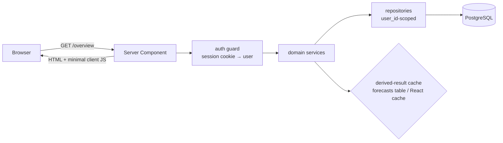
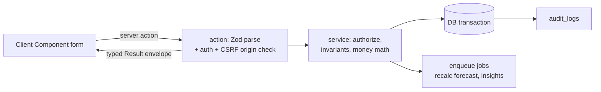
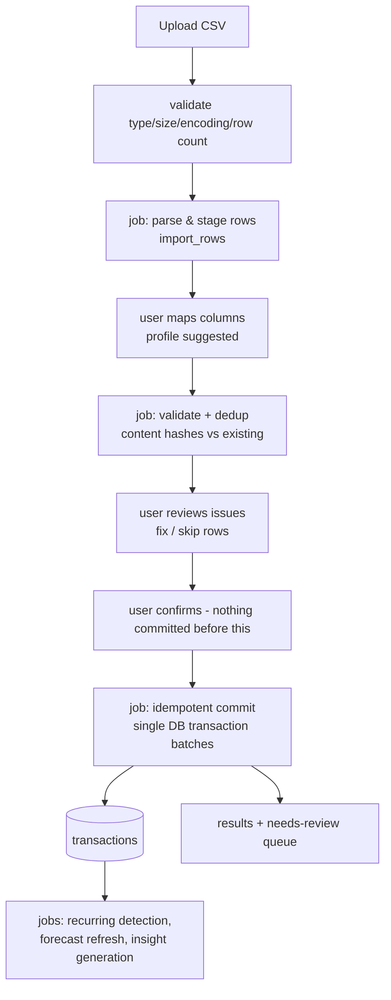
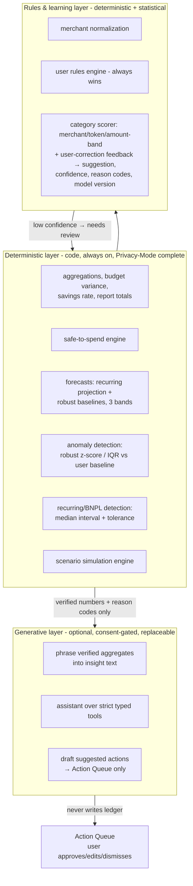

# FinPilot — Technical Architecture (Phase 0)

---

## 1. Stack (decided; rationale in ADRs, §7)

| Layer | Choice |
|---|---|
| Framework | Next.js (current stable, App Router), TypeScript `strict` |
| Rendering | React Server Components by default; Client Components only where interaction demands |
| Database | PostgreSQL 16+, source of truth; DBeaver as admin client only |
| ORM / migrations | Drizzle ORM + drizzle-kit versioned SQL migrations |
| Validation | Zod schemas shared across forms, server actions, route handlers, job payloads, and AI tool boundaries |
| Styling / UI | Tailwind CSS + shadcn/ui (Radix primitives), tokenized design system |
| Charts | Recharts, wrapped in accessible chart components (table alt, tooltips, legend) |
| Auth | Self-managed email/password (Argon2id) + DB-backed opaque sessions in HttpOnly cookies |
| Jobs | pg-boss (PostgreSQL-backed queue) behind an internal `JobQueue` interface |
| AI | Provider-independent `AIProvider` interface; **no adapter implemented before Phase 8**, where the first provider is selected via configuration/env; deterministic fallback always |
| Files | `FileStorage` interface: local disk (dev) / S3-compatible (prod), signed short-lived URLs |
| Tests | Vitest (unit/integration) + Testing Library, Playwright (e2e + axe + viewports) |
| Quality | ESLint, Prettier, `tsc --noEmit`, lefthook pre-commit, CI gate (lint + types + migrate-from-empty + tests) |

## 2. Application boundaries

```text
src/
  app/                    # routes: thin — validate, authorize, call services, render
    (auth)/  (app)/  api/
  components/             # design-system primitives (no domain logic)
  features/               # domain UI + feature hooks, one folder per domain
    accounts/ transactions/ categories/ budgets/ goals/
    recurring/ imports/ analytics/ scenarios/ insights/
    journal/ notifications/ onboarding/ settings/
  server/
    auth/                 # sessions, password hashing, rate limiting, guards
    db/                   # drizzle schema, migrations, repositories
    jobs/                 # JobQueue interface + pg-boss adapter + handlers
    ai/                   # AIProvider interface, adapters, prompts/ (versioned), tools/
    services/             # framework-independent domain services (the business logic)
  lib/                    # money, dates/tz, result envelope, zod utils, i18n
  styles/                 # tokens.css, tailwind config
```

**Dependency rule:** `app → features → server/services → server/db`. Services are framework-free
(no Next.js imports) and take `(ctx: { userId, tx? }, input)` — this is where authorization,
invariants, and money math live. Route handlers and server actions never contain business logic.

**Module boundaries enforced** by ESLint import rules: `features/*` may not import each other's
internals (only public `index.ts`), `components/` may not import `features/` or `server/`,
`server/services` may not import React.

## 3. Request and data-flow architecture

### Read path (RSC-first)



### Write path (typed server actions)



Server actions for closely-coupled UI mutations; **route handlers** for imports (multipart upload),
exports (streaming CSV), assistant streaming (SSE), attachment access (signed), and future webhooks.
Both share the same Zod schemas and service layer. Success/error envelope:
`{ ok: true, data } | { ok: false, error: { code, message, fieldErrors? } }` — provider/DB details
never leak to the client. Pagination is cursor-based (`(txn_date, id)` keyset) for transaction lists.
Import commits and retriable writes require idempotency keys; high-risk edits carry `version` for
optimistic concurrency.

### Import pipeline (background jobs)



Background jobs (pg-boss, in-process workers): import parse/commit, recurring detection, forecast
computation, anomaly scan, insight generation, digest assembly, notification fan-out, retention
cleanup, staged-deletion purge. Every job: Zod-validated payload, idempotent handler, retry with
backoff, dead-letter logging. The `JobQueue` interface keeps pg-boss replaceable.

## 4. Authentication & session design

- Argon2id password hashing (tuned params documented in code); opaque 256-bit session tokens,
  SHA-256-hashed at rest; cookie: `HttpOnly; Secure; SameSite=Lax; Path=/`.
- Session rotation on login and privilege-relevant changes; absolute lifetime 30 days, idle timeout
  14 days; sessions listable/revocable in Settings → Security.
- Rate limiting (per-IP + per-identifier, Postgres-backed token bucket) on sign-in, sign-up, reset;
  enumeration-safe responses; reset tokens single-use, 30-minute expiry, hashed at rest.
- CSRF: server actions verified by Next.js origin checks + SameSite; route-handler mutations require
  the custom header/double-submit pattern.
- Passkey-ready: auth service exposes `verifyFirstFactor()` abstraction; `webauthn_credentials`
  table design reserved (post-MVP).

## 5. Caching & derived data

- Deterministic derived results (forecasts, safe-to-spend inputs, anomaly baselines) are cached in
  the `forecasts` table keyed by `inputs_hash`; ledger writes enqueue invalidation/recompute jobs.
- Request-scope memoization via React `cache()`; no cross-user cache keys anywhere. HTTP caching
  only for static assets — financial data is always `no-store`.
- Account `current_balance` is computed (opening + sum of non-deleted transactions) with the
  snapshot table as reconciliation checkpoints — no dual-written running balance to drift.

## 6. AI & analytics architecture

An LLM is not the AI system. Three layers with hard boundaries:



### Responsibility split (binding)

| Concern | Layer |
|---|---|
| Every number a user sees (totals, %, forecasts, safe-to-spend, scenario outputs) | Deterministic code, unit-tested |
| Category suggestions | Rules first (user rules always win), then scorer; low confidence → Needs Review; corrections logged as feedback, batch-incorporated (never instant retrain on one correction) |
| Insight *content* (what changed, by how much) | Deterministic detectors producing structured facts + evidence |
| Insight *phrasing* | Generative when enabled; deterministic templates otherwise (and as fallback on provider error/timeout) |
| Assistant answers | Generative composition over **structured tool results only** — no SQL generation, no raw table access, no arithmetic performed by the LLM |
| Actions/changes to data | Only via Action Queue with explicit user approval |

### Safe-to-spend (deterministic definition)

`STS_until_payday = liquid_balance + expected_income_by_payday − confirmed_bills − predicted_bills − budget_committals − goal_contributions_due − safety_buffer`, computed per band (conservative uses
low-income/high-bill estimates; optimistic the reverse) → displayed as a range when bands diverge;
`STS_today = remaining band ÷ days_to_payday` with front-loaded bill reservation. Every term is
itemized for the "why" drawer.

### Assistant tool design

- Fixed tool registry (e.g. `get_spending_summary`, `get_category_trend`, `get_upcoming_bills`,
  `get_safe_to_spend`, `run_affordability_check`, `get_goal_status`) — each: Zod input/output,
  server-side `user_id` injection (never model-supplied), pre-aggregated results with row caps,
  and the filters/period echoed back for display in the answer card.
- Prompt-injection defenses: user-content fields (merchant names, descriptions, notes, CSV text)
  are delimited as data and never concatenated as instructions; tool outputs are data-only JSON;
  the system prompt forbids instruction-following from retrieved content; refusal boundaries and
  injection attempts covered by golden fixtures; numeric claims in generated text are re-verified
  against tool results before render (mismatch → deterministic fallback).
- Every generative call logged to `ai_requests` (model, prompt version, tokens, duration, status —
  redacted errors, no raw financial payloads); user-visible AI activity page reads from it plus
  `insights`/`ai_suggestions`.
- Provider abstraction: `AIProvider.complete(request: { messages, tools?, maxTokens, … })` —
  provider-independent; the first adapter is selected in Phase 8 via configuration/env (ADR-012).
  Prompts versioned in `server/ai/prompts/` and referenced by id+version in logs and outputs.

### Privacy Mode

Per-user switch (plus product-level kill switch via env). When on: zero external AI calls (enforced
at the `AIProvider` gateway, e2e-tested), assistant hidden with explainer, insights/suggestions from
deterministic paths only. Consent (`ai_consent_at`) is required before the first generative call;
the settings page documents exactly which features send what data shape to which provider.

## 7. Architecture decision records

Format: **Decision — rationale — consequences.** All accepted 2026-08-16; supersede by new ADR only.

- **ADR-001 Next.js App Router, RSC-first, TS strict.** Required stack; RSC keeps financial data
  server-side by default and minimizes client JS. *Consequence:* interaction islands must be
  consciously chosen; contributors need RSC discipline.
- **ADR-002 PostgreSQL as sole source of truth; no second datastore in MVP.** Fewer consistency
  problems; queue, cache, and search ride on Postgres (pg-boss, derived tables, pg_trgm).
  *Consequence:* revisit only if profiling proves Postgres is the bottleneck.
- **ADR-003 Money = `bigint` minor units + `char(3)` currency; signed amounts (negative = outflow).**
  Exact arithmetic, unambiguous direction, cheap sign-checks. *Consequence:* a `Money` lib module is
  the only place amounts are formatted/parsed; floats are lint-banned in money paths.
- **ADR-004 UUIDv7 app-generated IDs.** Time-ordered (index-friendly), generatable client-side for
  optimistic UI, no central sequence. *Consequence:* Postgres < 18 lacks native v7 — generated in app
  code, which also keeps IDs testable/deterministic in fixtures.
- **ADR-005 Self-managed credentials auth + DB sessions (no NextAuth/hosted IdP).** Email/password +
  HttpOnly cookie sessions + rate limiting are first-class requirements and simpler to audit
  self-built on Postgres than bent into an OAuth-centric library; hosted IdPs conflict with the
  privacy posture. *Consequence:* we own the security-critical code — offset by focused tests,
  the Phase 10 security review, and the risk register.
- **ADR-006 pg-boss behind a `JobQueue` interface.** Meets "Postgres-backed jobs, no extra infra";
  interface keeps BullMQ/SQS swappable. *Consequence:* job throughput bounded by Postgres — fine at
  MVP scale; watch queue depth in observability.
- **ADR-007 Drizzle ORM + generated SQL migrations, forward-only.** Typed schema near SQL semantics;
  migration files reviewable in PRs and runnable by DBeaver users. *Consequence:* migration
  discipline (§ ERD doc 5) is mandatory from Phase 1.
- **ADR-008 Zod at every boundary** (forms, actions, route handlers, job payloads, AI tools, rule
  conditions, import mappings). One schema source per shape in `lib/` or the owning feature.
  *Consequence:* parse-don't-validate style; `unknown` in, typed out.
- **ADR-009 Recharts wrapped in our own chart kit.** Accessible defaults (table alt, legend,
  tooltips, band charts) built once; validated chart palette (design doc §4). *Consequence:* feature
  code may not import Recharts directly.
- **ADR-010 Authorization in the service layer (no Postgres RLS in MVP).** Every repository call is
  `user_id`-scoped from the authenticated session — ownership is **never** accepted from a
  client-supplied `user_id`, and changing IDs in URLs or payloads must not bypass authorization.
  Cross-user isolation is integration-tested per entity (read, update, delete, tampered IDs,
  unauthenticated access). RLS adds pooling/role complexity now. *(Amended at Phase 0 review:)*
  **PostgreSQL RLS is a recorded security decision that must be explicitly reconsidered before the
  Production V1 release — it is a Phase 10 security-review gate item, not an open-ended "later."**
  *Consequence:* the isolation test suite is non-negotiable CI from Phase 1.
- **ADR-011 Deterministic core precedes generative AI (Phases 1–7 have zero LLM dependency).**
  Privacy Mode is then a feature flag, not a rewrite. *Consequence:* insight/forecast engines must
  produce structured facts + deterministic template text from day one.
- **ADR-012 AI provider bound by configuration, selected in Phase 8** *(amended at Phase 0 review —
  supersedes "Anthropic first")*. The `AIProvider` interface stays provider-independent; **no
  adapter is implemented before Phase 8**, and the first adapter is chosen then via configuration
  and environment variables (`AI_PROVIDER`, provider-specific keys). Anthropic remains documented
  as a provisional candidate only. A stub/test adapter proves the interface swaps cleanly.
  *Consequence:* Phases 1–7 contain zero provider SDK dependencies; provider-specific prompt tuning
  stays isolated in the adapter when it arrives.
- **ADR-013 Category suggestions are rules + statistical scorer, not per-transaction LLM calls.**
  Cost/latency/determinism at import scale; LLM reserved for phrasing and low-volume drafting.
  *Consequence:* scorer quality depends on merchant normalization — built early (Phase 2).
- **ADR-014 Payday-aware budget cycles are materialized as `budget_periods` rows.** Computing
  cycles on the fly from rules invites off-by-one chaos around weekend/holiday adjustment; explicit
  periods make history queryable. *Consequence:* a period-roll job + tested `cycle_anchor` resolver.
- **ADR-015 Derived analytics cached in tables (`forecasts`), invalidated by jobs, never trusted
  as source.** Recompute is always safe; `inputs_hash` prevents stale reads. *Consequence:* ledger
  writes must enqueue invalidation consistently (single service chokepoint).
- **ADR-016 i18n scaffolding from Phase 1** (message catalog, `Intl` number/date formatting via
  locale tokens, no hardcoded strings in components). *Consequence:* small constant tax per
  component; `ms-MY`/`zh-MY` become content work, not refactors.
- **ADR-017 Incremental per-domain migrations** *(added at Phase 0 review — supersedes the earlier
  plan to migrate the full schema in Phase 1)*. Each phase migrates only the tables its domain
  requires, per the schedule in the ERD doc §5.1; Phase 1 migrates exactly `users`,
  `user_preferences`, `sessions`, `password_reset_tokens`, `audit_logs`. The full ERD remains the
  reviewed target model. Rationale: schema review happens against real usage per phase, unused
  tables never ship half-validated, and each migration is small and reviewable. All migrations stay
  forward-only, version-controlled SQL, PostgreSQL/DBeaver-compatible. *Consequence:* later phases
  own their DDL; cross-domain FKs land with the later of the two domains.
- **ADR-018 Service-layer authorization is confirmed for Production V1; PostgreSQL RLS is not
  adopted** *(added at the Phase 10 security review — resolves and supersedes the "must be
  reconsidered before Production V1" clause of ADR-010, which is now closed rather than open)*.
  The reconsideration was performed in full and recorded in
  [../ops/security-review.md](../ops/security-review.md) §1. Reasons: the app runs on one pooled
  role, so RLS would require `SET LOCAL` on every pool checkout — a control whose failure mode is
  silent widening — or per-user roles the pooler cannot share; the hand-written analytics/forecast
  CTEs and the `information_schema`-driven purge sweep would all need re-profiling; and pg-boss plus
  migrations would need `BYPASSRLS` carve-outs. The compensating controls are stronger than "we
  scope in code": ownership is only ever taken from the server-side session, 33 database triggers
  reject child rows whose owner disagrees with their parent, and per-entity cross-user isolation
  tests (including tampered ids and unauthenticated access) are CI-blocking. *Consequence:* the
  isolation suite is a release gate — red means no release. **Revisit if** a second operator gains
  database access, a shared/multi-tenant workspace feature lands, a third party gets direct SQL
  access, or an IDOR-class incident occurs.

## 8. Observability & operations (MVP scope)

- Structured JSON logs (pino) with request id, user id (uuid only), event codes; **redaction layer
  strips amounts, descriptions, tokens, and emails from log payloads by schema, not by regex luck.**
- Metrics: request latency, job queue depth/failures, import throughput, AI token spend per feature,
  forecast staleness. Health endpoint checks DB + queue.
- Error tracking with scrubbed payloads; alert on auth anomaly spikes, job dead-letters, and AI
  fallback rate.
- Backup/restore runbook + deployment configuration written in Phase 10 (documented target: Docker
  container + managed Postgres with PITR). *Shipped:* [../ops/observability.md](../ops/observability.md),
  [../ops/backup-restore.md](../ops/backup-restore.md) (drill executed),
  [../ops/deployment.md](../ops/deployment.md), [../ops/incident-response.md](../ops/incident-response.md).
